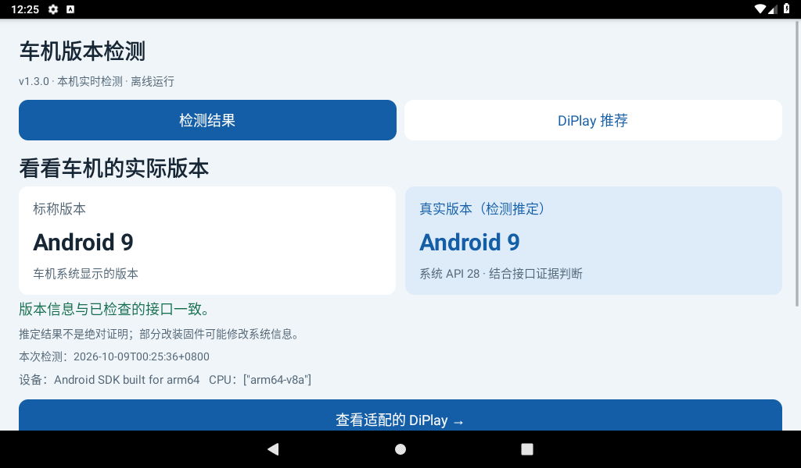
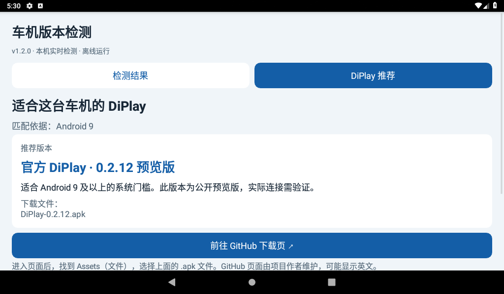
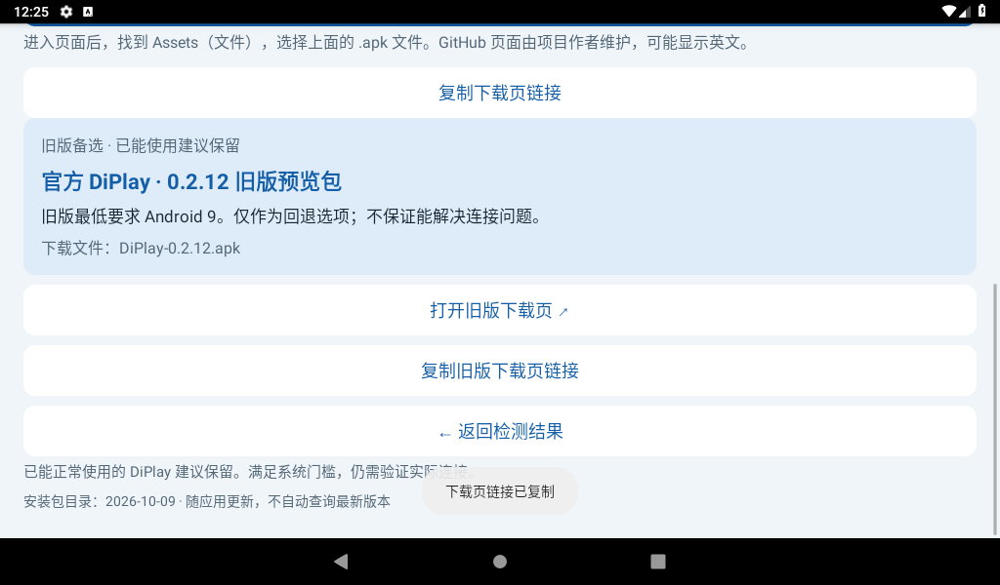

# 车机版本检测

离线 Android APK：显示车机标称版本与结合 API、公开接口所得的检测推定版本，再提供中文 DiPlay 推荐与 GitHub 下载页跳转。

当前版本 **1.3.0 安装使用版**。本次更新纳入官方 DiPlay 0.2.15 的 Android 7.1 / API 25 最低门槛，并保留旧版备选。

## 下载与安装

- [下载 APK](https://github.com/493330227-wq/headunit-version-inspector/releases/download/v1.3.0/headunit-inspector-1.3.0.apk)
- [发布页及源码](https://github.com/493330227-wq/headunit-version-inspector/releases/tag/v1.3.0)
- [使用说明](docs/usage.txt)

将 APK 复制到 U 盘，在车机文件管理器中安装。无需 Root 或 ADB，打开即读取本机数据。与历史版本同包名同签名，已验证从 1.2.0 覆盖升级。

检测软件最低 Android 4.0 / API 14，零应用权限。外部浏览器打开 GitHub 时需要联网。

## 界面

检测结果先显示标称版本和真实版本（检测推定），推荐页显示匹配依据、新版本和旧版备选。接口证据冲突、未知 API 或架构不匹配时不提供下载链接。

以上为 Android 9 / API 28 / ARM64 模拟器上实际安装 APK 后的截图，数据由该安卓系统实时提供，不是用户车机检测结果。

[交互演示](docs/demo.html) 可离线双击打开，含 11 个模拟场景；不会检测电脑或车机。演示与 APK 推荐使用同一 Java Rules 类。

## 推荐规则

| 检测条件（接口与架构符合） | 主推荐 | 旧版备选 |
| --- | --- | --- |
| API 28–37，Android 9 及以上 | 官方 0.2.15 公开预览版 | 官方 0.2.12 旧版预览包 |
| API 26–27，Android 8.0–8.1 | 官方 0.2.15 公开预览版 | KrunkZhou Android 8 v0.2.6 |
| API 25，Android 7.1 | 官方 0.2.15 公开预览版 | Legacy v0.2.7 |
| API 19–24，Android 4.4–7.0 | Legacy v0.2.7 | 无 |
| API 18 以下、接口冲突、未知 API、架构不匹配 | 无已核验推荐 | 无 |

目录核验日期 **2026-10-09**，随应用发版更新，不自动联网查询。[catalog.json](catalog.json) 记录发布页、实际最低 API、CPU 架构、SHA-256 及验证范围。

官方 0.2.15 仍为作者定义的公开预览版。Android 7.1–8.1 支持尚未完成车机验证；官方主要面向比亚迪，其他品牌及后装车机不保证兼容。符合安装门槛不等于 CarPlay 连接、触控或音频正常。已经正常使用的旧版建议保留。

固件可能修改 API 信息、回移或裁剪接口，因此“真实版本”是检测推定，不能保证识破所有伪装。本项目只提供第三方原作者发布页，不附带第三方 APK。

## 验证

- 137 项推荐与版本规则断言，含 API 24/25/26/27/28 边界及下载阻断。
- 63 项浏览器演示检查：11 个场景、320/600/1024 宽度、详情和复制成功提示。
- 30 项原生 APK 检查：Android 9 / API 28 / ARM64 上安装、覆盖升级、本机数据、新旧推荐链接 Intent、剪贴板、重新检测、报告导出。
- ZIP 完整性、对齐和 v1/v2/v3 签名检查。

原生测试拦截外部浏览器与分享 Intent；未测试实体车机或其他 API 的实际运行。新旧 APK 链接不代表车机连接验证。

## 隐私与构建

检测离线运行，不修改车机设置。报告保存在缓存，仅在用户主动导出时授予选定分享应用临时读取权限。报告可能包含固件指纹和机型。

需要 Python 3、JDK 17、Android 平台 35 与 Build Tools 35。设置 JAVA_HOME（bin 加入 PATH）、ANDROID_JAR、ANDROID_BUILD_TOOLS、SIGNING_KEYSTORE、SIGNING_PASSWORD 后运行 `python3 build.py`。签名 alias 为 headunit；发布私钥不在仓库，自签名包不能覆盖维护者签名包。

构建自动运行 RulesTest、生成 APK、演示与校验记录。浏览器测试源码见 tests/demo.test.cjs，原生测试见 tests/android/build_test.py。

APK SHA-256：`6c0b9935fdb0c366c61ec174cad9e38cc54d9ccb0dfb2dee6d1b555821ed4bc9`

证书 SHA-256：`b52c4a944aa2745283cd3c3d70091a98c59eb417f79b9dca815b73683e355042`
