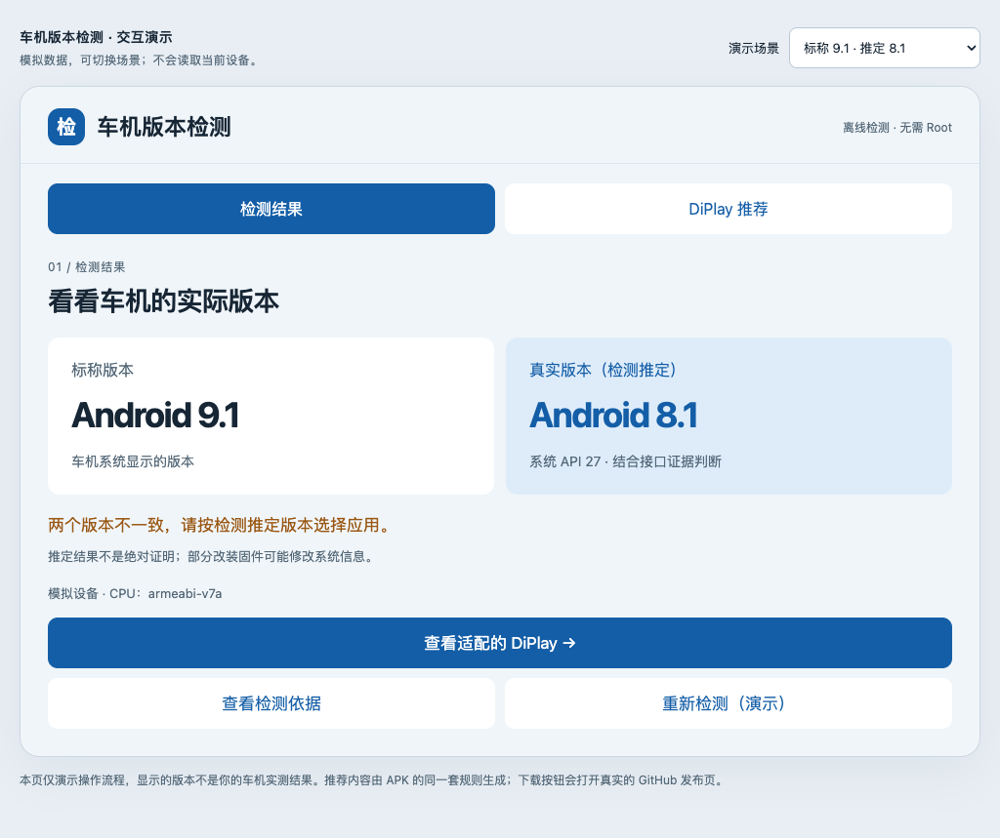
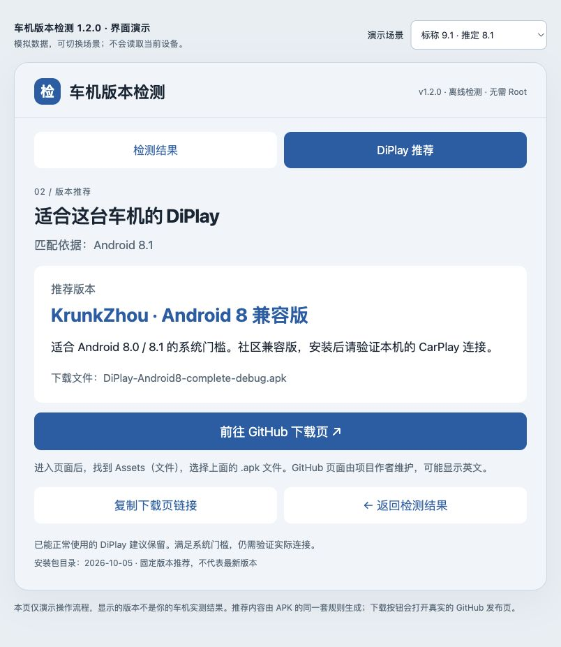

# 车机版本检测

一个离线运行的 Android APK：先比较车机的**标称版本**与**检测推定版本**，再推荐符合系统门槛的 DiPlay 安装包，并跳转至对应的 GitHub 发布页。

> 当前版本：**1.1.0 预览版**。已通过构建、签名和规则检查；尚未完成 Android 模拟器或实体车机运行验证。

## 下载与安装

- [下载 APK：headunit-inspector-1.1.0.apk](https://github.com/493330227-wq/headunit-version-inspector/raw/refs/heads/main/dist/headunit-inspector-1.1.0.apk)
- [版本发布页](https://github.com/493330227-wq/headunit-version-inspector/releases/tag/v1.1.0)
- [使用说明](docs/usage.txt)

将 APK 放入 U 盘，在车机文件管理器中打开并安装。打开应用即自动扫描，无需 Root 或 ADB。若已安装 1.0.0，可尝试直接覆盖安装；两个版本使用相同包名和签名。

最低安装门槛为 **Android 4.0 / API 14**；应用没有原生库，不申请网络、存储、定位或蓝牙权限。GitHub 下载页面由外部浏览器打开，需要浏览器能够联网。

## 两个页面

1. **检测结果**：显示标称版本、真实版本（检测推定）、系统 API、架构和检测依据。
2. **DiPlay 推荐**：显示中文说明、推荐安装包名称，以及“前往 GitHub 下载页”按钮；也可以复制链接到手机或电脑打开。





以上截图和 [交互演示](docs/demo.html) 使用模拟数据，不代表任何具体车机的实测结果。下载仓库后双击 `docs/demo.html`，可以体验 7 个场景及页面切换。

## 推荐规则

| 检测条件 | 推荐 |
| --- | --- |
| API 28 及以上且已收录、接口检查与架构匹配 | 官方 DiPlay 0.2.12 公开预览版 |
| API 26–27 | KrunkZhou Android 8 兼容版 v0.2.6 |
| API 19–25 | Legacy Android v0.2.7 社区试用版 |
| API 18 及以下 | 没有已核验的适配包 |
| 接口证据冲突、API 未收录或架构未匹配 | 暂停推荐，显示原因 |

安装包目录核验日期为 **2026-10-05**，属于固定版本目录，不代表 GitHub 当前最新版本。包来源、最低 API、架构和 SHA-256 记录在 [catalog.json](catalog.json)。

“真实版本（检测推定）”是结合固件报告的 API 与公开接口所得的推定。固件可以修改系统信息，接口也可能被回移或裁剪，因此不能保证识别所有伪装。满足系统门槛也不代表 CarPlay 认证、连接、触控或音频一定正常。已经正常使用的 DiPlay 建议保留。

本项目不附带第三方 DiPlay 安装包，只提供原作者的发布页链接。

## 隐私

检测不发起网络请求、不修改车机设置。报告保存在应用缓存；仅在用户主动分享时，向选定应用提供临时读取权限。报告可能包含机型、固件指纹和系统信息。

## 构建

需要 Python 3、JDK 17、Android 平台 35 的 `android.jar`、Android Build Tools 35（`aapt2`、`d8`、`zipalign`、`apksigner`）。不依赖 Gradle或第三方 Android 库。

设置以下环境变量后运行 `python3 build.py`：

- `JAVA_HOME`：JDK 目录；将其 `bin` 加入 `PATH`。
- `ANDROID_JAR`：平台 35 的 `android.jar` 完整路径。
- `ANDROID_BUILD_TOOLS`：Build Tools 35 的目录。
- `SIGNING_KEYSTORE`：你自己的签名 keystore，alias 必须为 `headunit`。
- `SIGNING_PASSWORD`：keystore 密码，仅放入本地环境，不提交到仓库。

自行构建需要自己的签名。维护者发布私钥不在本仓库中；使用不同密钥签名的 APK 不能覆盖维护者签名的已安装版本。

构建脚本会生成 APK、签名校验结果和演示页面，并运行 74 项规则断言。演示样例由同一个 Java `Rules` 类生成，避免另写一份推荐逻辑。

浏览器演示测试需要 Node.js、Playwright 和 Chrome：

```sh
node tests/demo.test.cjs
```

可通过 `PLAYWRIGHT_MODULE` 指定 Playwright 模块路径、`CHROME_BIN` 指定浏览器程序。已验证 7 个场景、320/600/1024 像素宽度，共 62 项交互检查。浏览器演示测试不替代原生 APK 运行测试。

## 文件校验

APK SHA-256：

```text
15d8aa8f5c5b9348422910f509255628364b07bdf6815b9006c6a99afbf9ce1b
```

签名证书 SHA-256：

```text
b52c4a944aa2745283cd3c3d70091a98c59eb417f79b9dca815b73683e355042
```

详细说明见 [架构与维护](docs/architecture.txt)。
